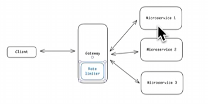

# 🚦 API Rate Limiter Design

## 📌 What is a Rate Limiter?
A **rate limiter** controls the rate of traffic sent by a client or service.  
In HTTP systems, it restricts the number of requests allowed within a time window.  
If the threshold is exceeded, excess calls are blocked with **HTTP 429 (Too Many Requests)**.

---

## ✅ Benefits
- **Prevent DoS attacks** → avoids resource starvation.  
- **Reduce cost** → fewer unnecessary requests to paid third-party APIs.  
- **Protect servers** → prevents overload from bots or misbehaving clients.  

---

## 🧭 Types of Rate Limiter
- **Client-Side** → implemented in SDKs, browsers, or apps.  
- **Server-Side** → enforced at API gateway, load balancer, or backend service.  

---

## ⚙️ Throttling Basis
Rate limiting can be applied based on:
- **IP Address**  
- **User Identity / API Key**  
- **Time Window**  

---

## 🏗️ Framework for Design
1. **Understand Requirements**  
   - Functional & Non-Functional  
2. **Identify Core Entities**  
3. **Define API / System Interfaces**  
4. **Data Flow**  
5. **High-Level Design (HLD)**  
6. **Deep Dive into Algorithms & Storage**  

---

## 📋 Functional Requirements
- Identify users by **ID, IP, API-Key**.  
- Limit requests based on **configurable rules** (e.g., 100 requests/min).  
- Return proper **HTTP status codes & headers** (429 + Retry-After).  
- Configurable **scope**: per-user, per-IP, per-service.  

👉 Always clarify **scale** with interviewer:
- **Users**: e.g., 100M DAU  
- **Requests per second (RPS)**: e.g., 1M RPS  

---

## 📊 Non-Functional Requirements
- **Availability > Consistency** (CAP theorem trade-off).  
- **Latency**: rate limit check < **10ms**.  
- **Scalability**: handle **1M RPS**.  
- **Fault tolerance**: degrade gracefully under load.  
- **Distributed system support**: multiple API gateways.  

---

## 🧩 Core Entities
- **User / Client** → identified by API key, IP, or token.  
- **Rate Limit Rule** → defines threshold (e.g., 100 requests/min).  
- **Counter / Token Bucket** → tracks usage.  
- **Storage** → Redis / Memcached for fast distributed counters.  

---

## 🔌 API / System Interface
- isRequestAllowed(clientId, rulesId) -> { passes: boolean,  remainingRequest : number, resetTime: timeStamp}
---

### Questions
- Where do we place the rate limitter? 
- How should we identify Client?

## 🔄 Data Flow
1. Client sends request → API Gateway.  
2. Gateway extracts **user identity**.  
3. Gateway queries **Rate Limiter Service**.  
4. Service checks counter in **Redis**.  
5. If within limit → forward request.  
6. If exceeded → return **429 Too Many Requests**.  

---

## 🏗️ High-Level Design (HLD)

