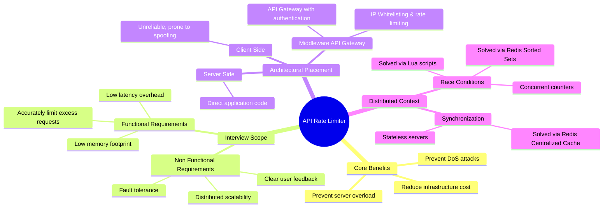
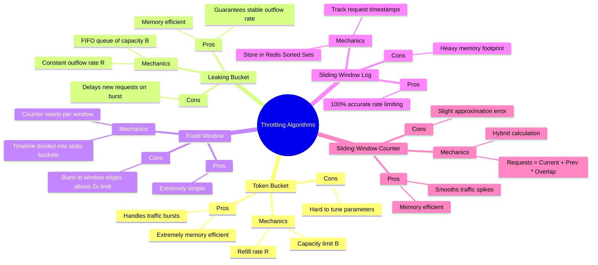
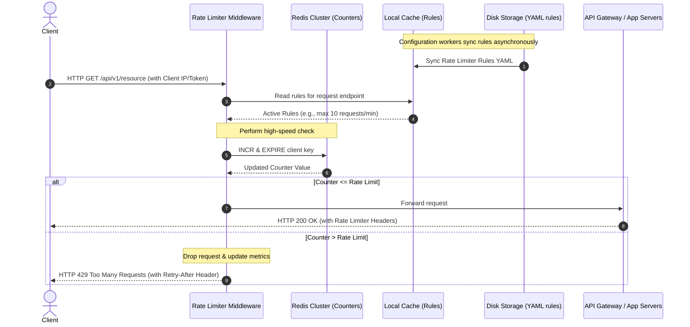

# Design a Rate Limiter — Ultimate Revision Notes & Mind Maps

This document is a comprehensive, highly visual study guide for designing an **API Rate Limiter** at the scale of millions of users [17]. It is optimized for quick interview revision, specifically targeting the high-bar expectations of companies like **Google, Amazon, and Microsoft** [17].

---

## 🗺️ Master Mind Map: Rate Limiter Landscape

This mind map visualizes the requirements, architectural placement, distributed system challenges, and client notifications.



---

## 📈 Mind Map: The 5 Throttling Algorithms

Each algorithm represents a trade-off between memory footprint, accuracy, and burst handling.



---

## 🎛️ Algorithm Comparison Matrix (Infographic Layout)

This matrix compares the core characteristics of the five rate-limiting algorithms to help you make active architectural trade-offs during your interview.

```text
┌──────────────────────────┬──────────────────────┬──────────────────────┬──────────────────────────┬──────────────────────────┐
│ ALGORITHM                │ MEMORY COMPLEXITY    │ TIME COMPLEXITY      │ BURST TRAFFIC?           │ BEST USE CASE            │
├──────────────────────────┼──────────────────────┼──────────────────────┼──────────────────────────┼──────────────────────────┤
│ Token Bucket [23, 24, 25]│ O(1)                 │ O(1)                 │ Yes                      │ Standard APIs            │
│                          │ 2 variables per user │ Single cache lookup  │ Allows instant burst     │ (Stripe, Amazon)         │
├──────────────────────────┼──────────────────────┼──────────────────────┼──────────────────────────┼──────────────────────────┤
│ Leaking Bucket [26, 27]  │ O(B)                 │ O(1)                 │ No                       │ Background jobs,         │
│                          │ Queue size B         │ Push to queue        │ Smoothed to fixed rate   │ Shopify API integration  │
├──────────────────────────┼──────────────────────┼──────────────────────┼──────────────────────────┼──────────────────────────┤
│ Fixed Window [27, 28, 29]│ O(1)                 │ O(1)                 │ Partially                │ Quota resets at round    │
│                          │ 1 counter per window │ Counter increment    │ 2x spike at window edge  │ intervals (e.g. daily)   │
├──────────────────────────┼──────────────────────┼──────────────────────┼──────────────────────────┼──────────────────────────┤
│ Sliding Log [30, 31, 32] │ O(B)                 │ O(log B)             │ Yes                      │ High-security, low QPS   │
│                          │ Stores timestamps    │ Redis ZREMRANGEBYSCORE│ Absolute precision      │ transactional systems    │
├──────────────────────────┼──────────────────────┼──────────────────────┼──────────────────────────┼──────────────────────────┤
│ Sliding Counter [32, 33] │ O(1)                 │ O(1)                 │ Yes                      │ Real-time high-throughput│
│                          │ 2 counters per window│ Constant math        │ Smooths edge cases       │ systems (Cloudflare)     │
└──────────────────────────┴──────────────────────┴──────────────────────┴──────────────────────────┴──────────────────────────┘
```

---

## 📐 Back-of-the-Envelope Capacity Estimations

During an interview, you must lead with structured estimations to size your database, cache, and bandwidth constraints [9]. Let us model a system design for a massive scale of **10 Million Daily Active Users (DAU)**.

### 1. Request Load & QPS Estimates
*   **Daily Active Users (DAU):** $10 \text{ Million}$
*   **Average API Calls per User per Day:** $100$
*   **Total API Calls per Day:**
    $$\text{Total Calls} = 10 \text{ Million} \times 100 = 1,000,000,000 \text{ requests/day}$$
*   **Average Queries Per Second (QPS):**
    $$\text{Average QPS} = \frac{1,000,000,000 \text{ requests}}{86,400 \text{ seconds}} \approx 11,574 \text{ QPS}$$
*   **Peak QPS (assuming a burst multiplier of 2x):**
    $$\text{Peak QPS} = 11,574 \times 2 \approx 23,148 \text{ QPS}$$

---

### 2. Redis Cache Storage Estimations (Crucial Comparison)
Using an in-memory cache like Redis is crucial because disk database access is too slow for real-time traffic filtering [36]. Let's compare the storage overhead of the **Token Bucket** algorithm against the **Sliding Window Log** algorithm.

#### Case A: Memory Estimate for Token Bucket / Simple Counter
We store each user's rate limits as a simple key-value record in Redis [36]:
*   **Key Format:** `user:rate:<user_id>` (e.g., `"user:rate:10203040"` $\approx 24 \text{ bytes}$)
*   **Value Format (Hash):** Stores `counter` (integer, $4 \text{ bytes}$) + `last_updated_timestamp` (Unix epoch, $4 \text{ bytes}$).
*   **Redis Entry Overhead:** Redis introduces metadata overhead (dictEntry, robj wrapper, jemalloc padding), which averages **$250 \text{ bytes}$** per key-value pair.
*   **Total Memory Storage:**
    $$\text{Memory Size} = 10,000,000 \text{ active users} \times 250 \text{ bytes} = 2,500,000,000 \text{ bytes} \approx \mathbf{2.5 \text{ GB}}$$
*   *Conclusion:* A single modern Redis server can easily fit the rate limiting data for 10 million users in RAM [5, 36]!

#### Case B: Memory Estimate for Sliding Window Log (Redis Sorted Set)
Instead of storing a single counter, we must log every request timestamp in a Redis sorted set (`ZSET`) to achieve 100% precision [30]:
*   **Average Log Size per User:** Let's assume each user averages $20 \text{ requests}$ inside their active window.
*   **Sorted Set Element Cost:** Each element in a ZSET (skip-list node + hash entry + timestamp data) averages **$100 \text{ bytes}$** in Redis memory.
*   **Total Timestamps Stored:**
    $$\text{Total Elements} = 10,000,000 \text{ users} \times 20 \text{ timestamps} = 200,000,000 \text{ elements}$$
*   **Total Memory Storage:**
    $$\text{Sorted Set Entry Overhead} = 10,000,000 \text{ users} \times 250 \text{ bytes} = 2.5 \text{ GB}$$
    $$\text{Timestamp Logs Cost} = 200,000,000 \text{ elements} \times 100 \text{ bytes} = 20 \text{ GB}$$
    $$\text{Total RAM Required} = 2.5 \text{ GB} + 20 \text{ GB} = \mathbf{22.5 \text{ GB}}$$
*   *Conclusion:* **Sliding Window Log requires 9x more memory** ($22.5 \text{ GB}$ vs $2.5 \text{ GB}$) than Token Bucket! In your interview, present this as a critical cost-complexity trade-off.

---

## 🏗️ Detailed Architecture & System Design

To build a production-grade rate limiter, you must coordinate configuration workers, central cache servers, and request routing middleware [41].

### Detailed Request Flow Sequence



### Essential API Headers & Throttled Responses [40]
When a user hits the throttle limit, the server must return an **HTTP 429 Too Many Requests** code [20, 39, 41] along with detailed debugging headers so the client knows how to behave [40]:

```http
HTTP/1.1 429 Too Many Requests
Content-Type: application/json
X-Ratelimit-Limit: 10
X-Ratelimit-Remaining: 0
X-Ratelimit-Retry-After: 42
{
  "status": 429,
  "error": "Too Many Requests",
  "message": "API quota exceeded. Please slow down and retry after 42 seconds."
}
```

---

## ⚡ Distributed System Challenges & Solutions

A single-server rate limiter is straightforward, but synchronization and race conditions are the primary hurdles at scale [42, 44].

### Challenge 1: The "Read-Then-Write" Race Condition [42]
In a concurrent environment, two requests might read the counter simultaneously before either completes the increment write back [42, 43]:

```text
Request Thread A (Server 1)                 Request Thread B (Server 2)
     │                                           │
     ├───► Read Counter (value = 3)              ├───► Read Counter (value = 3)
     │                                           │
     ├───► Check 3 + 1 < Limit (Allowed)         ├───► Check 3 + 1 < Limit (Allowed)
     │                                           │
     ├───► Write back (value = 4)                ├───► Write back (value = 4)
     ▼                                           ▼
             [Correct Value should be 5! One request bypassed the check!]
```

*   **❌ Unacceptable Solution:** Local mutex locks. This slows down processing significantly and creates an extreme bottleneck in high-throughput environments [43].
*   **✅ Standard Solution (Lua Scripts):** Wrap the Read, Check, and Write logic inside a **Redis Lua Script** [43]. Redis executes Lua scripts atomically on a single thread, guaranteeing that no other command can run mid-execution, preventing race conditions.
*   **✅ Alternative Solution:** Use Redis **Sorted Sets** with bitwise operations, or rely on Redis concurrent atomic commands.

---

### Challenge 2: Stateless Server Synchronization [44]
If your web tier is stateless, successive requests from Client 1 might land on different rate limiting middleware instances [44]:

```text
                  ┌──────────────┐
                  │   Client 1   │
                  └──────┬───────┘
            ┌────────────┴────────────┐
            ▼                         ▼
   ┌─────────────────┐       ┌─────────────────┐
   │ Rate Limiter 1  │       │ Rate Limiter 2  │
   │  (Counter = 1)  │       │  (Counter = 1)  │
   └────────┬────────┘       └────────┬────────┘
            └────────────┬────────────┘
                         ▼
             [Centralized Redis Cache]
             [ Counter total sync = 2 ]
```

*   **❌ Unacceptable Solution:** Sticky sessions. They are neither scalable, flexible, nor fault-tolerant [45].
*   **✅ Standard Solution (Centralized Cache):** Keep the rate limiter web servers stateless, routing all middleware requests to check counters against a centralized high-speed cache cluster, such as **Redis** [45].

---

## 🎯 Pro-Tips for Google, Microsoft, and Amazon Interviews

When designing a Rate Limiter for FAANG-level engineering positions, look for opportunities to demonstrate deep architectural maturity:

1.  **Multi-Level Rate Limiting (Layer 3 vs. Layer 7):**
    *   Do not just mention HTTP rate limiters (Layer 7) [47]. Show that you can apply rate limiting at different levels of the OSI model. Mention using **Iptables** to drop malicious or volumetric flood traffic at the IP Layer (Layer 3) to prevent server networking stacks from being overwhelmed [47].
2.  **Hard vs. Soft Rate Limiting:**
    *   *Hard Rate Limiting:* Absolutely enforce limits without exception (e.g., commercial API calls) [47].
    *   *Soft Rate Limiting:* Allow brief, controlled spikes above the threshold (e.g., during low traffic density, or letting standard users burst during flash sales) [46, 47].
3.  **Performance Optimization via Edge Deployments:**
    *   Latency is high for users located far from the main data center [45]. To speed up checks, place rate limiter middleware at geographically distributed edge servers (e.g., **CDNs like Cloudflare** with edge routing) to resolve requests locally and reduce latency [45].
4.  **Graceful Client-Side Cooperation:**
    *   A robust client should avoid triggering rate limits [47]. Explain how you would design clients to cache API responses locally, catch 429 exceptions gracefully, and implement **exponential backoff with jitter** on their retry logic to prevent retry stampedes on recovering servers [47].
