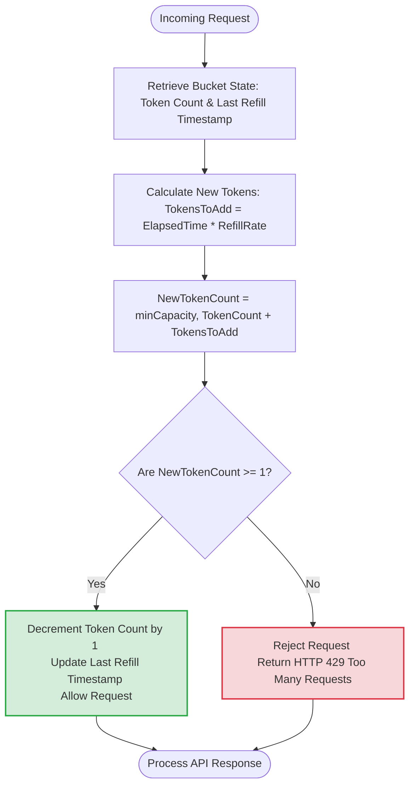
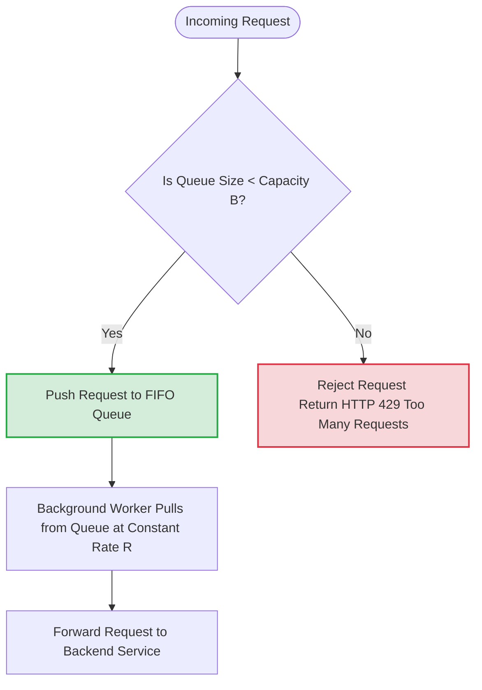
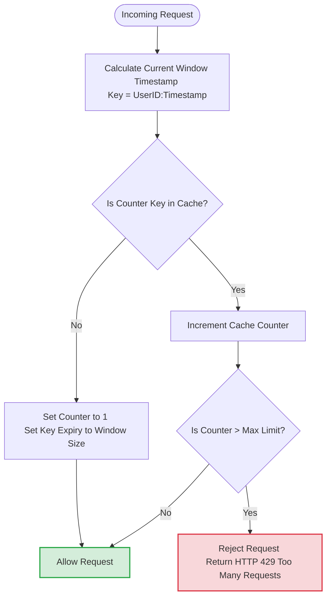
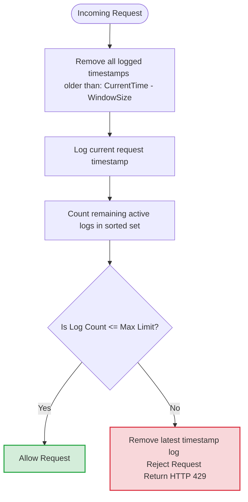
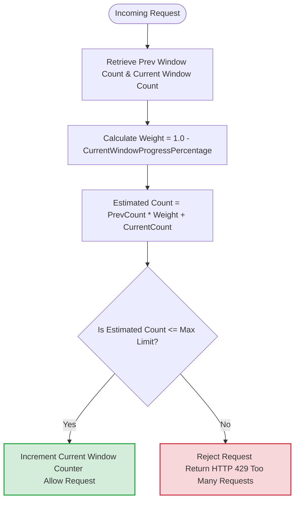

# 📊 Visual Infographics & Real-World Use Cases: Rate Limiting Algorithms

This document contains highly detailed, professional infographics and architectural flowcharts for the five primary rate-limiting algorithms, along with real-world examples of which industry giants use each approach. 

These visual diagrams are fully compatible with GitHub and markdown viewers, allowing you to quickly visualize how traffic is throttled at FAANG-level scale [17].

---

## 🪙 1. The Token Bucket Algorithm

The **Token Bucket** is one of the most widely used algorithms due to its simplicity, low memory footprint, and ability to handle short bursts of traffic [23].

### 🏢 Real-World Use Case
*   **Used by:** **Amazon** [11] and **Stripe** [11].
*   **Why they use it:** It allows clients to occasionally burst their traffic (e.g., sending multiple rapid requests) as long as there are accumulated tokens in the bucket [13]. It is extremely memory-efficient, storing only two variables (tokens and last updated timestamp) per user [23].

### 🎨 Visual Architecture Infographic

### ⚙️ Algorithmic Decision Tree (Mermaid)

---

## 🪣 2. The Leaking Bucket Algorithm

The **Leaking Bucket** uses a first-in, first-out (FIFO) queue to guarantee a constant, smooth rate of outgoing traffic, making it perfect for backend processing pipelines [13, 26].

### 🏢 Real-World Use Case
*   **Used by:** **Shopify** [15].
*   **Why they use it:** Shopify uses this for their REST Admin API to ensure that clients do not spike or overwhelm backend databases. Requests are smoothed to a stable, continuous outflow rate [15].

### 🎨 Visual Architecture Infographic

### ⚙️ Algorithmic Decision Tree (Mermaid)

---

## 🪟 3. The Fixed Window Counter Algorithm

The **Fixed Window Counter** divides the timeline into static, non-overlapping windows (e.g., 1 minute) and tracks the request count within each window [16].

### 🏢 Real-World Use Case
*   **Used by:** **Google Docs API** [3].
*   **Why they use it:** Google Docs uses a fixed-window quota system (e.g., 300 requests per user per 60 seconds) [3]. This works perfectly for resetting available quotas at human-friendly intervals (like at the start of a new minute or day) [18].

### 🎨 Visual Architecture Infographic

### ⚙️ Algorithmic Decision Tree (Mermaid)

---

## 📜 4. The Sliding Window Log Algorithm

The **Sliding Window Log** solves the window boundary spike problem of the Fixed Window algorithm by tracking the exact timestamps of every request in a sorted set (usually Redis Sorted Sets `ZSET`) [18].

### 🏢 Real-World Use Case
*   **Used by:** **ClassDojo** [36].
*   **Why they use it:** ClassDojo uses rolling rate limits powered by Redis Sorted Sets [36] because they require absolute precision in rolling windows [20]. This prevents boundary-edge bursts and guarantees that a client can never exceed their rate limits within any rolling timeframe [18].

### 🎨 Visual Architecture Infographic

### ⚙️ Algorithmic Decision Tree (Mermaid)

---

## 📊 5. The Sliding Window Counter Algorithm

The **Sliding Window Counter** is a memory-efficient hybrid of Fixed Window and Sliding Log [20]. It estimates the request rate mathematically based on the percentage of overlap between the current time and the two adjacent fixed windows.

### 🏢 Real-World Use Case
*   **Used by:** **Cloudflare** [23].
*   **Why they use it:** Cloudflare operates at a global scale, where tracking raw timestamp logs consumes far too much memory [20]. This hybrid algorithm requires checking only two counters per window, saving massive amounts of memory [22]. It provides a near-perfect approximation of the actual rate: Cloudflare's experiments across 400 million requests showed that only 0.003% of requests were wrongly allowed or throttled [23].

### 🎨 Visual Architecture Infographic

### ⚙️ Algorithmic Decision Tree (Mermaid)

