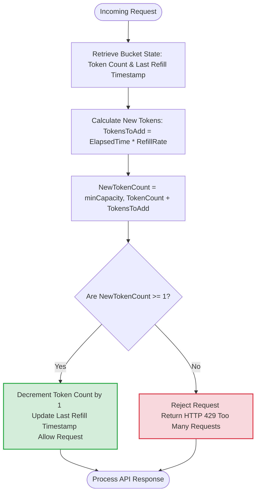
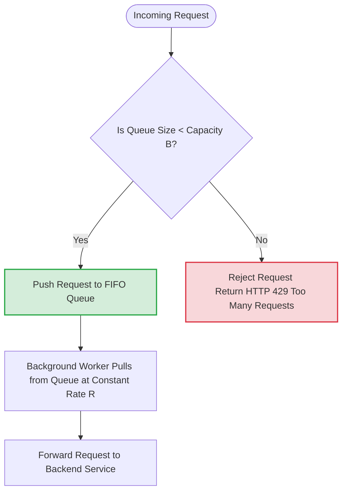
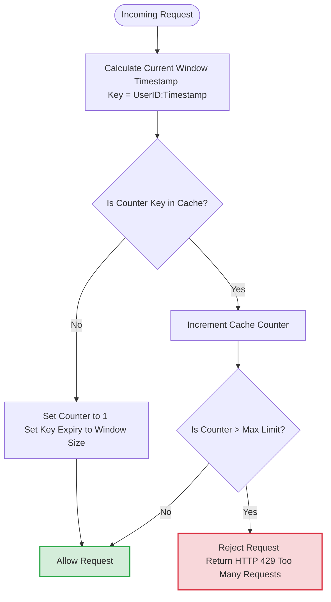
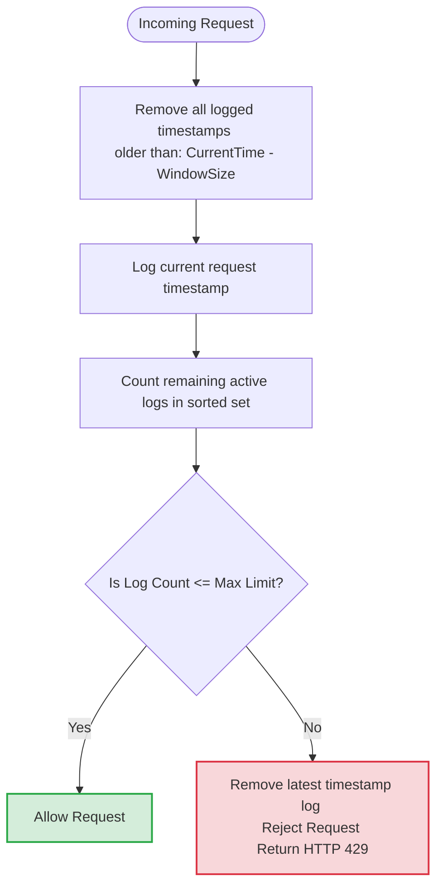
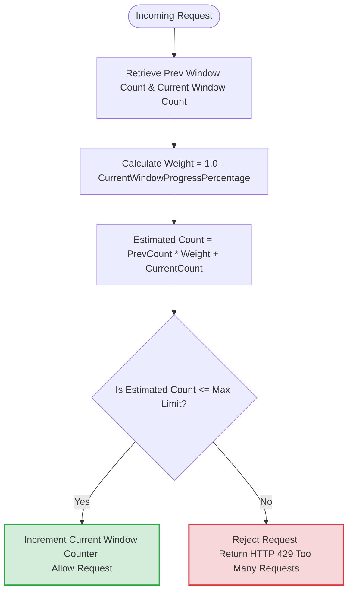

# 📊 Visual Infographics: Rate Limiting Algorithms

This document contains highly detailed, visual infographics designed as **Mermaid.js flowcharts** and **ASCII architecture diagrams** to help you master the exact mechanics, internal decision trees, and trade-offs of the five primary rate-limiting algorithms. 

These diagrams are fully compatible with GitHub and markdown viewers, allowing you to quickly visualize how traffic is throttled at FAANG-level scale [17].

---

## 🪙 1. The Token Bucket Algorithm

The **Token Bucket** is one of the most widely used algorithms due to its simplicity, low memory footprint, and ability to handle short bursts of traffic [23].

### 🎨 Visual Architecture (ASCII Infographic)
```text
           Refill Rate (R tokens/sec)
                  │
                  ▼
         ┌─────────────────┐
         │  TOKEN BUCKET   │
         │  (Capacity = B) │ <─── If full, extra tokens overflow/discarded
         │  ┌───────────┐  │
         │  │ 🪙 🪙 🪙  │  │
         │  └───────────┘  │
         └────────┬────────┘
                  │
                  │ Incoming Request
                  ▼
         ┌─────────────────┐
         │ Are tokens > 0? │
         └───────┬─────────┘
                 │
         ┌───────┴───────┐
         │               │
      YES│             NO│
         ▼               ▼
   Consume 1 Token  Drop/Reject Request
   & Allow Request  (HTTP 429 Too Many Requests)
```

### ⚙️ Algorithmic Decision Tree (Mermaid)


---

## 🪣 2. The Leaking Bucket Algorithm

The **Leaking Bucket** uses a first-in, first-out (FIFO) queue to guarantee a constant, smooth rate of outgoing traffic, making it perfect for backend processing pipelines [26].

### 🎨 Visual Architecture (ASCII Infographic)
```text
         Incoming Requests (Highly variable / bursty)
            │      │      │      │
            ▼      ▼      ▼      ▼
         ┌──────────────────────────┐
         │     LEAKING BUCKET       │
         │   (FIFO Queue of Cap B)  │ <─── If queue is full, new requests 
         │ ┌──────────────────────┐ │      are immediately dropped/rejected
         │ │  📥  📥  📥  📥  📥  │ │
         │ └──────────────────────┘ │
         └────────────┬─────────────┘
                      │
                      │ Constant Outflow Rate (R requests/sec)
                      ▼
         ┌──────────────────────────┐
         │     Backend Servers      │
         └──────────────────────────┘
```

### ⚙️ Algorithmic Decision Tree (Mermaid)


---

## 🪟 3. The Fixed Window Counter Algorithm

The **Fixed Window Counter** divides the timeline into static, non-overlapping windows (e.g., 1 minute) and tracks the request count within each window [27, 28].

### 🎨 Visual Architecture (ASCII Infographic)
```text
  Timeline:  |── Window N-1 ──|─────── Window N ───────|── Window N+1 ──|
             |  (0:00 - 1:00) |     (1:00 - 2:00)      |  (2:00 - 3:00) |
             |                |                        |                |
  Requests:  |  📥  📥  📥    |  📥 📥 [Max Limit=2] ⚠️ |      📥        |
             |                |        ▲        ▲      |                |
             |  Count = 3     |  Count=1       Count=2 |  Count = 1     |
                              └────────────────────────┘
                                 Counter resets to 0
```
> **⚠️ The Edge Case Spike Problem:** If a user makes 2 requests right at the end of Window N-1 (e.g., 0:59) and another 2 requests at the start of Window N (e.g., 1:01), they successfully bypass the rate limit and execute **4 requests in a span of 2 seconds**!

### ⚙️ Algorithmic Decision Tree (Mermaid)


---

## 📜 4. The Sliding Window Log Algorithm

The **Sliding Window Log** solves the window boundary spike problem of the Fixed Window algorithm by tracking the exact timestamps of every request in a sorted set (usually Redis Sorted Sets `ZSET`) [30, 31].

### 🎨 Visual Architecture (ASCII Infographic)
```text
           Current Timestamp = 1:00:15 PM  (Window Size = 1 Minute)
           
  Log Window starts at 12:59:15 PM  <──────────────────────> Ends at 1:00:15 PM
  
  ┌────────────────────────────────────────────────────────────────────────┐
  │ Timestamps Log:                                                        │
  │  [12:58:30]  │  [12:59:20]  │  [12:59:55]  │  [1:00:05]  │  [1:00:12]  │
  └──────┬───────┴──────┬──────────────┬──────────────┬──────────────┬─────┘
         │              │              │              │              │
         ▼              └──────────────┴──────┬───────┴──────────────┘
  OUT OF WINDOW (Pruned)                  STILL ACTIVE (Count = 4)
  Deleted via ZREMRANGEBYSCORE            If Count <= Max Limit, allow request!
```

### ⚙️ Algorithmic Decision Tree (Mermaid)


---

## 📊 5. The Sliding Window Counter Algorithm

The **Sliding Window Counter** is a memory-efficient hybrid of Fixed Window and Sliding Log [32, 33]. It estimates the request rate mathematically based on the percentage of overlap between the current time and the two adjacent fixed windows.

### 🎨 Visual Architecture (ASCII Infographic)
```text
    Prev Window (1:00 - 2:00)       Current Window (2:00 - 3:00)
    ┌───────────────────────────┐   ┌───────────────────────────┐
    │  Counter = 100 requests   │   │  Counter = 30 requests    │
    └───────────────────────────┘   └───────────────────────────┘
    [░░░░░░░░░░░░░░░░░░░░░░░░░░░]   [▓▓▓▓▓▓▓▓▓▓▓▓▓▓▓▓▓▓▓▓▓▓▓▓▓▓▓]
                          ▲             ▲
                          │             │ Current Time = 2:18 (18% of Current Window is gone)
                          
                          ◀─────── Sliding Revision Log Window ───────▶
                            30% overlap with current, 70% overlap with prev
                            
  🧮 Estimated Requests = (Prev Count * 70%) + Current Count
                        = (100 * 0.70) + 30 
                        = 70 + 30 = 100 requests (Compared against Limit)
```

### ⚙️ Algorithmic Decision Tree (Mermaid)

