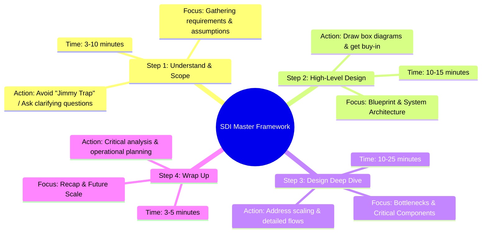
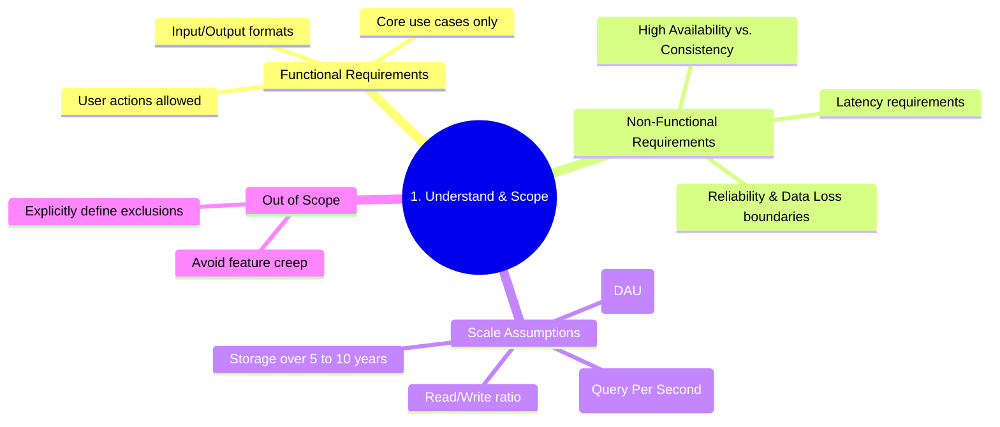
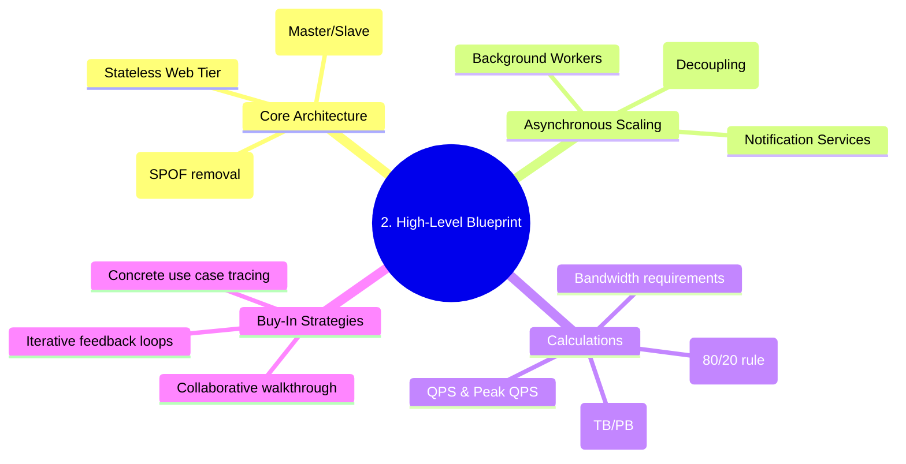
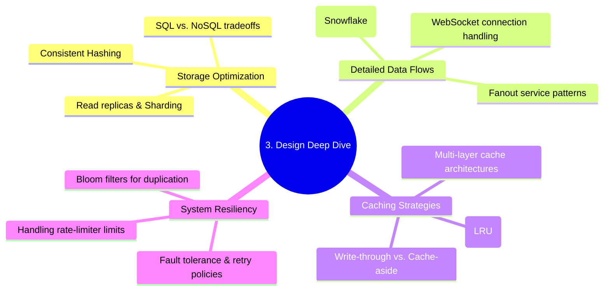
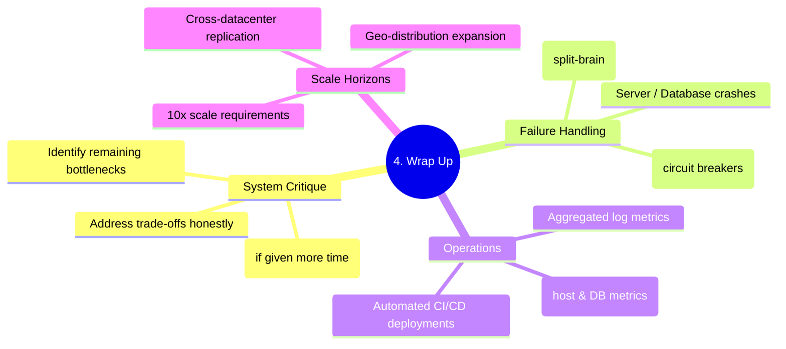
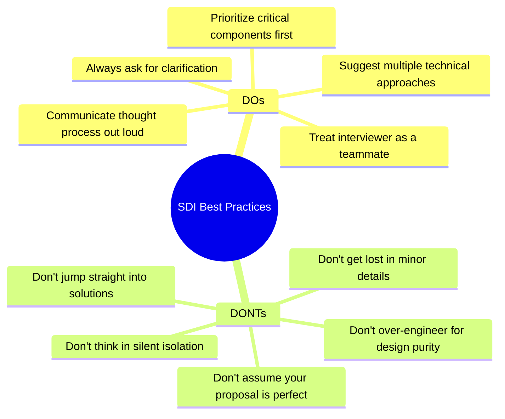

# The Ultimate System Design Interview Guide
> A highly visual, structured roadmap designed for cracking high-level technical assessments at Google, Amazon, Microsoft, and other tech giants.

---

## 🌟 Philosophy of the System Design Interview

A system design interview (SDI) is not a trivia contest or a test of design purity [15, 17]. It simulates real-world problem-solving where **two co-workers collaborate on an ambiguous problem** to arrive at a scalable, practical architecture [13]. 

Interviewers at big tech companies are not just checking your technical design skills; they are evaluating strong signals on [14]:
*   **Collaboration & Teamwork:** Can you accept feedback constructively and treat the interviewer as a teammate? [13, 14, 22]
*   **Handling Pressure:** Can you navigate open-ended, unclear scenarios with composure? [13, 14]
*   **Resolving Ambiguity:** Can you ask the right questions to define constraints and narrow a massive scope? [14, 15]
*   **Trade-off Awareness:** Do you recognize the compounding cost of over-engineered systems and design for real constraints? [15]

---

## 🗺️ The Master 4-Step Framework

System design interviews are typically 45 minutes to an hour [31]. Managing your time across these steps is critical [27, 31]:



---

## 🔍 Step 1: Understand the Problem & Establish Design Scope (3–10 Mins) [31]

### The "Jimmy" Trap
In system design, **never jump into a solution immediately** [17]. In school, "Jimmy" was the student who rushed to answer first to show off [16, 17]. In an interview, behaving like Jimmy is a massive red flag—it shows a lack of systematic thinking [17]. Slow down, think deeply, and gather requirements first [17].

### Critical Clarifications to Ask
*   **Specific Features:** What are the exact use cases we must support? [19] (e.g., "Is the news feed sorted chronologically or by relevance score?" [20, 65])
*   **Target Clients:** Is this mobile, web, or both? [20, 64]
*   **Scale Metrics:** How many Daily Active Users (DAU)? [21, 65] What is the expected QPS and storage footprint? [10, 83]
*   **Tech Stack Context:** What existing platforms or services can we leverage? [19, 80, 81]



---

## 📐 Step 2: Propose High-Level Design & Get Buy-In (10–15 Mins) [32]

Your objective here is to form an **initial blueprint** and reach a consensus with the interviewer [21]. Think of them as a teammate and collaborate actively [13, 22].

### Box Diagram Blueprinting
Draw high-level block diagrams representing key functional components [22]:
1.  **Clients:** Mobile and Web apps [22, 58].
2.  **API Gateways / Load Balancers:** Handling routing, authentication, and initial rate limiting [22, 67, 76].
3.  **Application Servers:** Stateless web servers representing service tiers [22, 50, 85].
4.  **Caches & Databases:** Storage tiers with replication (master-slave) [7, 22, 69].
5.  **CDNs:** Storing static assets or heavy files [9, 22, 81].
6.  **Message Queues:** For asynchronous task decoupling and horizontal scaling [22, 60, 66].

### Back-of-the-Envelope Estimation
Use quick, rough math to justify your design decisions (e.g., sizing the cache to fit 20% of daily traffic or determining database sharding requirements) [10, 83]. Always think out loud, write down assumptions, round your numbers, and label your units clearly [9, 18, 22].



---

## ⚡ Step 3: Design Deep Dive (10–25 Mins) [32]

With the blueprint approved, you must collaborate to **identify, prioritize, and drill down into the most critical system components** [25, 26].

### Prioritizing the Core Path
Focus on the bottleneck of the specific system you are designing [26]:
*   **URL Shortener:** Deep dive into hash function design (Base 62 vs. collision-prone MD5) [26, 48].
*   **Chat System:** Deep dive into persistent connections (WebSockets vs. Long Polling) and service discovery [26, 72, 74].
*   **Web Crawler:** Deep dive into the URL Frontier, politeness rules, and duplicate HTML detectors [54, 56].
*   **News Feed:** Deep dive into fanout strategies (Push model for normal users vs. Pull model for celebrities) [67, 75].

### Avoid Minor Distractions
Do not lose precious time explaining minor details that fail to show system design competency [27] (e.g., describing Facebook's exact EdgeRank machine learning algorithm in detail instead of database optimization) [27].



---

## 🏁 Step 4: Wrap Up (3–5 Mins) [32]

In the final minutes, demonstrate critical thinking by walking through refinements, operational maintenance, and edge cases [28].

### Wrap-Up Themes
1.  **Bottleneck Identification:** Never say your design is perfect—there are always trade-offs to optimize [28].
2.  **Failure Modes:** How does the system handle server failures, network loss, or database split-brain scenarios? [28, 90]
3.  **Metrics & Monitoring:** Detail what parameters are monitored (CPU, memory, disk I/O, QPS, error logs) [8, 28].
4.  **The Next Scale Curve:** If your design supports 1 million users, what explicitly changes when scaling to 10 million? [28]



---

## 🚥 The SDI Dos and Don'ts [29, 30]



---

## 🛠️ GitHub Integration Guide

Hosting this `.md` file on GitHub makes it an active, beautiful, and shareable asset. GitHub natively renders Mermaid.js blocks into interactive diagrams.

### How to Host This on GitHub:
1.  Create a new repository (e.g., `system-design-roadmap`).
2.  Create a file named `README.md` and copy this guide's content into it.
3.  Commit and push the file.
4.  To update any mind map, simply modify the text inside the standard triple-backtick markdown blocks labeled with `mermaid`:
    ```markdown
    ```mermaid
    mindmap
      root((Your Map Name))
        Branch 1
        Branch 2
    ```
    ```
5.  GitHub will automatically rebuild the SVG diagrams and display them beautifully in any browser.

---
*Created using the guidelines and framework of **System Design Interview: An Insider's Guide** by Alex Xu.*
